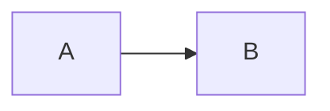

# mdview

Markdown ビューア。TUI・Electron GUI・JSON 出力など複数のフロントエンドに対応したワークスペース構成。

## クイックスタート

macOS arm64 想定。**Rust 1.86+ / Node.js 20+ / wasm-pack** が事前に入っている前提:

```bash
git clone https://github.com/coil398/mdview && cd mdview

# TUI と JSON バイナリをインストール（~/.cargo/bin/ に入る）
cargo install --path mdview-tui
cargo install --path mdview-json

# Electron GUI を /Applications/mdview.app に配置
cd mdview-electron && npm install && npm run dist:install
```

これで:

- ターミナルから `mdview README.md` で TUI 起動
- 外部ツール連携用に `mdview-json README.md | jq .` で AST を JSON 出力
- Spotlight で `mdview` と打つか Dock の `mdview.app` から GUI 起動
- neovim から `:Mdview` で floating window に TUI を開く（プラグイン導入時。下記「neovim プラグイン」参照）

> ℹ️ wasm-pack 未インストールなら `cargo install wasm-pack` で入れてから上の手順を実行。

## クレート構成

| クレート / ディレクトリ | 役割 |
|---|---|
| `mdview-core` | パーサーライブラリ（ratatui 非依存、serde 対応、WASM ビルド可） |
| `mdview-tui` | TUI ビューア（`mdview` コマンド） |
| `mdview-json` | JSON 出力（外部ツール連携用、`mdview-json` コマンド） |
| `mdview-electron` | Electron GUI アプリ（WASM 経由で `mdview-core` を利用） |
| `plugin/` + `lua/mdview/` + `doc/mdview.txt` | neovim プラグイン（Lua、`:Mdview` で TUI を floating 起動） |

## インストール

### リリース版（GitHub Releases）

ソースビルド不要で使いたい場合は [Releases](https://github.com/coil398/mdview/releases) からビルド済みアーティファクトを取得できる（バージョンタグごとに CI が自動生成）。

| ファイル | 対象 | 中身 |
|---|---|---|
| `mdview-<version>-aarch64-apple-darwin.tar.gz` | macOS (Apple Silicon) | `mdview` / `mdview-json` バイナリ |
| `mdview-<version>-x86_64-apple-darwin.tar.gz` | macOS (Intel) | 同上 |
| `mdview-<version>-x86_64-unknown-linux-gnu.tar.gz` | Linux (x86_64) | 同上 |
| `mdview-macos-arm64.zip` | macOS (Apple Silicon) | Electron GUI `mdview.app` |

各アーティファクトには `.sha256` が併置されるので `shasum -a 256 -c <file>.sha256` で検証できる。

CLI バイナリの配置例（PATH の通ったディレクトリへ）:

```bash
tar xzf mdview-<version>-aarch64-apple-darwin.tar.gz
cd mdview-<version>-aarch64-apple-darwin
install -m 755 mdview mdview-json ~/.cargo/bin/
```

Electron GUI は zip を展開して `mdview.app` を `/Applications/` へ:

```bash
unzip mdview-macos-arm64.zip
xattr -cr mdview.app && cp -R mdview.app /Applications/
```

> ⚠️ Electron の `.app` は ad-hoc 署名のみ・公証なし。Gatekeeper 警告が出たら `.app` を Finder で右クリック →「開く」で許可する。

### TUI / JSON（Rust）

ローカルクローン経由:

```bash
cargo install --path mdview-tui
cargo install --path mdview-json
```

git 経由（任意のディレクトリから）:

```bash
cargo install --git https://github.com/coil398/mdview mdview-tui
cargo install --git https://github.com/coil398/mdview mdview-json
```

### Electron GUI（macOS arm64）

`.app` をビルドして `/Applications/` に配置し、Dock / Spotlight から起動できるようにする:

```bash
cd mdview-electron
npm install              # 初回のみ
npm run dist:install     # /Applications/mdview.app に配置
```

ビルドのみ:

```bash
npm run dist             # dist/mac-arm64/mdview.app を生成
```

開発時の即時起動（パッケージ化なし）:

```bash
npm run dev              # WASM ビルド + electron .
```

> ℹ️ ad-hoc 署名のみ・公証なし。Gatekeeper の quarantine flag は `dist:install` 内で `xattr -cr` により除去するため、初回起動時の警告は出ない（はず）。出た場合は Finder で `.app` を右クリック → 「開く」で許可する。

### neovim プラグイン

リポジトリ自体（`coil398/mdview`）が neovim プラグインとして機能する。`plugin/`・`lua/mdview/`・`doc/mdview.txt` をリポジトリルートに配置しているため、lazy.nvim 等から `coil398/mdview` を直接インストールできる。

lazy.nvim の例:

```lua
{
  'coil398/mdview',
  cmd = 'Mdview',
  config = function()
    require('mdview').setup({
      -- 任意設定（省略時はデフォルト値が使われる）
      -- bin = 'mdview',
      -- window = { width = 0.85, height = 0.85, border = 'rounded' },
      -- auto_close_on_exit = true,
    })
  end,
}
```

別途、上記の TUI バイナリ（`mdview`）が PATH 上に必要。`cargo install --path mdview-tui`（ローカル）または `cargo install --git https://github.com/coil398/mdview mdview-tui` でインストールしておくこと。

## 使い方

### TUI

```bash
mdview <file.md>
```

#### キーバインド

| キー | 動作 |
|---|---|
| `q` / `Esc` | 終了 |
| `j` / `↓`, `k` / `↑` | スクロール / TOC カーソル移動 |
| `PageDown` / `PageUp` | ページスクロール |
| `g` / `G` | 先頭 / 末尾へ |
| `t` | TOC トグル |
| `Enter` | TOC 項目へジャンプ |
| `r` | 手動リロード |
| `/` / `Ctrl+F` | 検索開始 |
| `n` / `N` | 次 / 前のマッチへジャンプ |
| `m` | メモパネル トグル |

ファイルを保存すると自動でリロードされる。

### Electron GUI

[インストール](#electron-guimacos-arm64) を参照。`/Applications/mdview.app` を起動するか、開発時は `mdview-electron/` で `npm run dev`。

#### キーバインド

| キー | 動作 |
|---|---|
| `j` / `k` | スクロール |
| `g` / `G` | 先頭 / 末尾 |
| `t` | TOC トグル |
| `n` | メモパネル トグル |
| `h` / `l` | フォーカス移動（toc ↔ content ↔ notes） |
| `H` / `L` | フォーカス中サイドパネルの幅をリサイズ（20px 単位） |
| `r` | 手動リロード |
| `Cmd+O` | ファイルを開く |
| `Cmd+C` / `Cmd+A` | コピー / 全選択 |
| `Cmd/Ctrl+F` | 検索バーを開く |
| `Enter` / `Shift+Enter` | 次 / 前のマッチへジャンプ（検索バー内） |

TOC ↔ content ↔ notes の境界はマウスでドラッグしても幅変更可能。

#### 見出しごとのメモ

右側のメモパネル（`n` でトグル）には、現在ビューポート最上部にある見出しに紐付くメモが表示される。スクロールすると見出しが切り替わり、対応するメモも自動で切り替わる。500ms の debounce で `~/.config/mdview/notes.json` に永続化される。

### neovim プラグイン

`:Mdview` で現バッファのファイルを floating window 内に mdview TUI として開く:

```vim
:Mdview                    " 現バッファのファイルを開く
:Mdview path/to/file.md    " 指定パスを開く
:Mdview!                   " 未保存バッファを tmp 経由で強制的に開く
```

TUI 内で `q` / `Esc` を押すと TUI が終了し、floating window も自動で閉じる（terminal-mode キーマップは設定しないため TUI 側に直接届く）。

`:checkhealth mdview` でバイナリ検出状況と version を確認できる。詳細は `:help mdview`。

#### 設定オプション

| キー | デフォルト | 説明 |
|---|---|---|
| `bin` | `'mdview'` | mdview バイナリ名または絶対パス |
| `window.width` | `0.85` | 幅（0〜1: editor 比率、整数: 絶対セル数） |
| `window.height` | `0.85` | 高さ（同上） |
| `window.border` | `'rounded'` | `nvim_open_win` の `border` 値 |
| `window.title` | `' mdview '` | floating window のタイトル |
| `auto_close_on_exit` | `true` | TUI 終了時に window を自動 close |

### JSON 出力（外部ツール連携）

```bash
mdview-json <file.md>
```

`Document` を JSON で標準出力する。外部ツールはこのバイナリをサブプロセスとして呼び出し、出力を受け取って独自の描画を行う。

```json
{
  "schema_version": 2,
  "blocks": [
    {
      "Heading": {
        "level": 1,
        "spans": [{ "text": "Hello", "kind": "Normal" }]
      }
    },
    {
      "Paragraph": {
        "lines": [
          [{ "text": "world", "kind": "Normal" }]
        ]
      }
    }
  ],
  "toc": [
    { "block_index": 0, "title": "Hello", "level": 1 }
  ]
}
```

> **注意**: JSON スキーマは 2026-04-18 の B-2 rewrite で破壊的に変更されている（旧 `lines` / `line_index` 形式とは非互換）。現行スキーマは `schema_version: 2`。

#### Block 一覧

| Block | 意味 |
|---|---|
| `Paragraph { lines }` | 段落（HardBreak で区切られた行のリスト） |
| `Heading { level, spans }` | 見出し（レベル 1〜6、インライン Span 列を保持） |
| `List { ordered, start, items }` | リスト（`items: Vec<ListItem>` にネスト可） |
| `BlockQuote { blocks }` | 引用（再帰的にブロックを保持） |
| `CodeBlock { lang, code }` | コードブロック（言語指定あり） |
| `Table { header, rows, align }` | テーブル（セルは `Vec<Span>`、列ごとの整列指定付き） |
| `Rule` | 水平線 |

#### SpanKind 一覧（インラインのみ）

| kind | 意味 |
|---|---|
| `Normal` | 通常テキスト |
| `Bold` / `Italic` / `BoldItalic` | 強調 |
| `CodeInline` | インラインコード |
| `Link { url }` | リンク |

> 旧 `Heading` / `CodeBlock` / `BlockQuote` / `ListMarker` / `Rule` は Block 側に昇格したため、`SpanKind` からは削除されている。

## Mermaid ダイアグラム（Electron のみ）

Electron 版では `mermaid` コードブロックを [mermaid](https://mermaid.js.org/) で SVG レンダリングする。対応ダイアグラム: flowchart / sequence / class / state / ER / gantt / pie / Mindmap / Architecture ほか mermaid v11 がサポートする全種別。

使用例:

````markdown

````

- テーマ切替: 既存の 4 テーマに連動し、dark 系では mermaid の `dark` / light 系では `default` / `base` を適用する
- セキュリティ: `securityLevel: 'strict'` で初期化し、ダイアグラム内の HTML タグはエンコード、click 機能は無効化される
- TUI / `mdview-json` は mermaid レンダリングの対象外（通常のコードブロックとして表示される）

## テーマ設定

### 設定ファイル

`~/.config/mdview/config.json` にテーマ ID を記述する:

```json
{
  "schema_version": 1,
  "theme": "github-light"
}
```

ファイルが存在しない場合は default（`vscode-dark`）が使われる。未知のテーマ ID を書いた場合も同様に default へフォールバックし、警告が出力される。

### 利用可能なテーマ ID

| テーマ ID | 概要 |
|---|---|
| `vscode-dark` | VS Code Dark（**default**） |
| `vscode-light` | VS Code Light |
| `github-dark` | GitHub Dark |
| `github-light` | GitHub Light |
| `solarized-light` | Solarized Light |
| `solarized-dark` | Solarized Dark |
| `tokyo-night-light` *(Phase3 予定)* | Tokyo Night Light |
| `tokyo-night-dark` *(Phase3 予定)* | Tokyo Night Dark |
| `iceberg-light` *(Phase3 予定)* | Iceberg Light |
| `iceberg-dark` *(Phase3 予定)* | Iceberg Dark |

### TUI での指定

`--theme` オプションで起動時に上書きできる（`config.json` より優先される）:

```bash
mdview --theme github-light README.md
mdview --theme vscode-dark README.md
```

### Electron GUI での切り替え

メニューバーの「**表示 → テーマ**」からテーマを選択する。選択は即時反映され、`~/.config/mdview/config.json` に永続化される。

> **注意**: macOS / Windows でも `~/.config/mdview/config.json` を使う（Linux / WSL 主ターゲット設計のため）。

## 開発

- ビルド: `cargo build --workspace`
- テスト: `cargo test --workspace`
- Lint: `cargo clippy --workspace`
- フォーマット: `cargo fmt --all`

詳細は `CLAUDE.md` を参照。

## リリース（メンテナ向け）

バージョンタグ（`v*`）を push すると `.github/workflows/release.yml` が発火し、GitHub Releases にアーティファクトが自動添付される。

1. バージョンを揃えて bump する（Cargo 側は `Cargo.toml` の `[workspace.package]` の `version` 1 箇所、Electron 側は `mdview-electron/package.json` の `version`）
2. コミットしてタグを打って push する:

```bash
git tag v0.1.0
git push origin v0.1.0
```

3. ワークフローが以下を並列ビルドして同一 Release に添付する:
   - Rust バイナリ（`mdview` / `mdview-json`）を macOS arm64 / macOS x64 / Linux x86_64 の tar.gz で
   - Electron GUI（`mdview.app`）を macOS arm64 の zip で

> ℹ️ crates.io publish・Homebrew tap は未整備。`Cargo.toml` の publish メタデータは整備済みのため `cargo publish` 自体は将来対応可能。

## 要件

| ツール | 想定バージョン | 用途 |
|---|---|---|
| Rust | 1.86 以上 | TUI / JSON / WASM ビルド |
| Node.js | 20 LTS 以上 | Electron GUI |
| wasm-pack | 0.13 以上 | `mdview-core` の WASM ビルド（`cargo install wasm-pack`）|
| macOS | 13 以上（arm64） | Electron `.app` ビルド |

> ℹ️ Intel Mac の場合は `mdview-electron/package.json` の `"dist"` script の `--arm64` を `--x64` に書き換えて使う。

## トラブルシューティング

### Gatekeeper で「壊れているため開けません」と出る

ad-hoc 署名のみで公証していないため、初回起動で出ることがある。`xattr` で quarantine 属性を消せば回避できる:

```bash
xattr -cr /Applications/mdview.app
```

`npm run dist:install` 経由でインストールした場合はスクリプト内で実行済みのため、通常は出ない。

### WASM ビルドが失敗する

`wasm-pack` が cargo 1.86+ で `--out-dir` を unstable の `--artifact-dir` にマップしてしまう。`mdview-electron/package.json` の `build:wasm` は `--out-dir` を指定せずデフォルト `pkg/` に出力する設計のため通常は問題ないが、独自にコマンドを書く場合は同じパターンに従うこと。

### `cargo install --path mdview-tui` が遅い

初回は `syntect` / `ratatui` などのコンパイルで数分かかる。リリースビルド（`--release` がデフォルト）なので 2 回目以降はキャッシュが効く。
